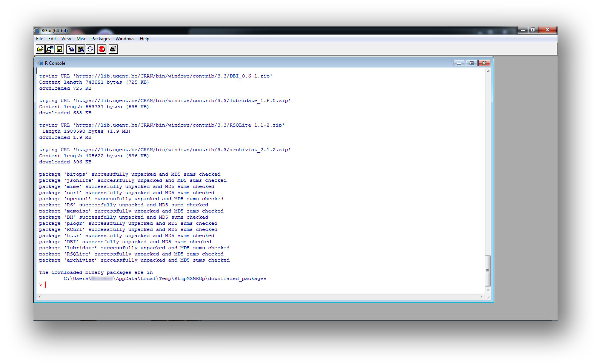

# R on proxy server (Windows chapter) #

* This README shows the procedures to run R (and RStudio) inside a proxy server (usually in universities and academics environments).

### How do I get set up? ###

* Summary of setup:
    - Install software
    - Run it
    - Run script
* Software needed:
    - [R](https://cran.r-project.org)
    - [RStudio Desktop](https://www.rstudio.com/products/rstudio/#Desktop) 
    - Update to the latest version of R and RStudio to minimize incompatibilities.
* Software version (tests):
    - R (Windows version): 3.3.3 64 bits
* Procedures:
    - Install [R](https://cran.r-project.org/bin/)
    - Install [RStudio Desktop](https://www.rstudio.com/products/rstudio/#Desktop)
    - Previously, gather information about the configuration of your proxy server: `IP address`, `port`, `username`, `password`

-----------------------
### Windows environment ###
* Deployment:
    - Run R
    - In the Console run this script:
        - `file.edit('~/.Renviron')`
    - Automatically it will bring a new window. Introduce this statements:
        - `options(internet.info = 0)`
        - `http_proxy = http:// username:password@19X.16X.X.X:3XXX`
        - `http_proxy_user = username:password`
        - `https_proxy = https:// username:password0@19X.16X.X.X:3XXX`
        - `https_proxy_user = username:password`
        - `ftp_proxy = username:password@19X.16X.X.X:3XXX`
    * It should be pointed that `username` must be replaced with your username; `password` with your password; `19X.16X.X.X` *i.e.* with this IP address `192.168.4.1` and `3XXX` *i.e.* with this port: `3128`
    * Restart R
    * In the console, introduce this statement
        - `install.packages("XXXXXXX",method="libcurl")`
    * Replace `"XXXXXXX"` with the [name of the package](https://cran.r-project.org/web/packages/available_packages_by_name.html) you need.

### Copyright ###

This work is licensed under a [Creative Commons Attribution-ShareAlike 2.0 Generic License](http://creativecommons.org/licenses/by-sa/2.0/).

### Legal ###

* All trademarks are the property of their respective owners.